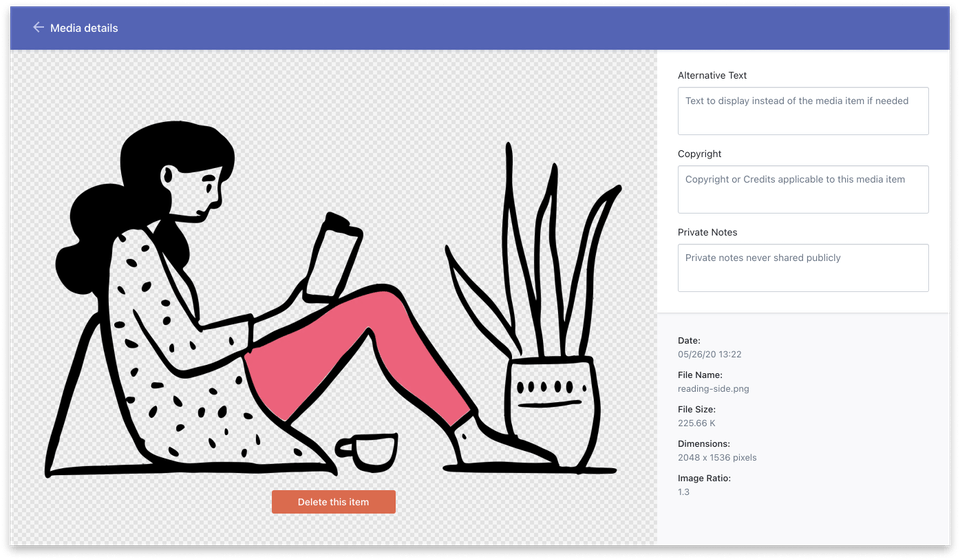

# tzitzit

This is a tool that helps the Editorial team add copyright information to images in Prismic.

You can find the tool at <https://s3-eu-west-1.amazonaws.com/tzitzit.wellcomecollection.org/index.html>


## Motivation

Within Prismic, the media editor only supports a single "Copyright" field:



Because we want more than just copyright information, we store structured data in this field, in particular:

*   The title
*   The author
*   The source name and link
*   The licence
*   The copyright holder and link

These values get concatenated into a pipe-separated string, which the Editorial team paste into this field, for example:

> Johnson Papyrus | Unknown maker, 400 CE | Wellcome Collection | | CC-BY-NC | |

The front-end code then unpacks this string and renders a caption on the image.
This caption is more than just static text; it includes hyperlinks and the full name of the licence.
(Look for TASL-related code in the wellcomecollection.org repo; TASL = Title Author Source Link).

Because this syntax isn't especially intuitive, the tzitzit tool helps the Editorial team assemble these strings.


## Deployment

tzitzit is served as a static HTML file from an S3 bucket.

To update the file, run the following command in the root of this repo:

```console
$ AWS_PROFILE=experience-dev aws s3 cp index.html s3://tzitzit.wellcomecollection.org/index.html --acl=public-read
```
